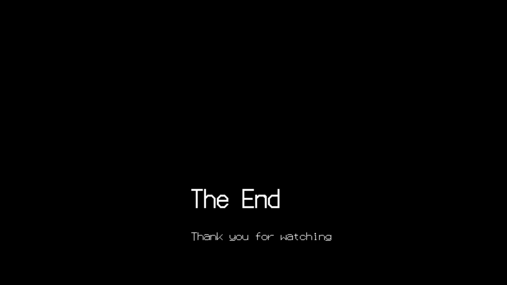

# **Demoscene**

### A non-interactive demonstration of audio and visual programming using OpenGL

Check out my Youtube video here:

[](https://www.youtube.com/watch?v=I9ETPMkormY)

---

> Graphics and sound library from [captainys](https://github.com/captainys)

> Audio from [@freemusicc](https://www.youtube.com/watch?v=OuRvOCf9mJ4&ab_channel=FreeMusic)

---

## **What is Demoscene?**

Demoscene is a computer subculture and artistic movement that emerged in the 1980s and centers around the creation of real-time audiovisual demonstrations, known as "demos," on computer platforms. These demos showcase the technical and artistic skills of programmers, artists, and musicians within a limited space and time frame. Demos typically feature graphics, sound, and often innovative programming techniques.


The demoscene began in the 1980s on home computer platforms like the Commodore 64 and Amiga. Early demos were often created by "cracking" groups to showcase their skills in breaking copy protection on games and software. Over time, the focus shifted from cracking to artistic expression and technical prowess. Demoscene groups formed, competing to create the most impressive demos at events known as "demoscene parties."


[Image Source](https://www.teodor.no/commodore/the-demo-scene)

## **Why create a Demo?**

Demoscene places a strong emphasis on technical artistry, where programming and graphic art are mixed to create interesting visual effects, animations, and intricate scenes that challenge the boundaries of what can be achieved with code. Programmers often delve into low-level rendering techniques, shaders, and optimization to create stunning visuals that captivate viewers and showcase their programming prowess.

Demos also often push hardware to its limits, demonstrating what was possible on older systems. Creating demos helps preserve computing history and demonstrates the enduring creativity of the demoscene community.

## **My Demo**

I was inspired by the more geometric-looking graphics in the example demos I watched and wanted to do something similar. I also wanted to incorporate elements of vaporwave and the outrun aesthetic to give it a feel of the 1980s, when demoscene began.

## Audio

While demos can feature a wide variety of music genres, demos on older platforms like the Commodore 64 and Amiga will often use chiptune music, characterized by the distinctive sound of vintage computer and video game hardware like the NES (Nintendo Entertainment System), Commodore 64, Atari 2600, and Game Boy. I chose [Density & Time - MAZE](https://www.youtube.com/watch?v=OuRvOCf9mJ4&ab_channel=FreeMusic) due to its catchy beat and chiptune sound.

## 3D graphics from Scratch

To make some simple moving geometric art using only C++, I first defined the shapes I was creating as a mesh of triangles. I first made a rotating cube on the 2D screen by definging the original object coordinates, projecting them into the virtual space using a projection matrix, and rotating it around various axes using rotation matrices.

To do this, I first normalized the screen space as shown below.


Normalizing the screen also ensures that the field of view is not limited to a rectangle but instead a space defined by a variable $\theta$. As $\theta$ increases, as shown in the above image, the field of view increases and has the effect of zooming out. On the other hand, decreasing $\theta$ narrows the field of view and has the effect of zooming in and therefore has the following effect on the x and y coordinates of the object that is being projected.

$$(x, y) \Rightarrow (\dfrac{\dfrac{w}{k}*\dfrac{1}{tan(\theta/2)}}{z})x, (\dfrac{\dfrac{1}{tan(\theta/2)}}{z})$$

When objects are further away, they appear to move less. This means the $x$ and $y$ coordinates are also affected by the depth. This is expressed in the above equation by dividing both $x$ and $y$ by $z$.

To define $z$, we first define virtual points $z_{near}$ and $z_{far}$ to normalize and create a scaling factor for the input $z$ values of the desired shape.

$$scaling factor = z_{normalized} - offset = \dfrac{z_{far}}{z_{far}-z_{near}} - \dfrac{z_{far}*z_{near}}{z_{far}-z_{near}}$$

Thus,

$$(x, y, z) \Rightarrow \left((\dfrac{\dfrac{w}{k}*\dfrac{1}{tan(\theta/2)}}{z})x, (\dfrac{\dfrac{1}{tan(\theta/2)}}{z}), \dfrac{z_{far}}{z_{far}-z_{near}}z - \dfrac{z_{far}*z_{near}}{z_{far}-z_{near}}\right)$$

To simplify this a bit let aspect ratio, $a = \dfrac{w}{h}$, field of view, $f = \dfrac{1}{tan(\theta/2)}$, and $q = z_{normalized} = \dfrac{z_{far}}{z_{far}-z_{near}}$, therefore:

$$(x, y, z) \Rightarrow \dfrac{af}{z}x, \dfrac{f}{z}y, qz - qz_{near}$$

Now we have a projection matrix:

$$
M =
\begin{pmatrix}
    af & 0 & 0 & 0 \\
    0 & f & 0 & 0 \\
    0 & 0 & q & 1 \\
    0 & 0 & -qz_n & 0
    \end{pmatrix}
$$

3d affine transformation matrices can then be used for translating, scaling, or rotating the points before projecting them:

$$
R_x(\theta) =
\begin{pmatrix}
    1 & 0 & 0 & 0 \\
    0 & cos(\theta) & sin(\theta) & 0 \\
    0 & -sin(\theta) & cos(\theta) & 0 \\
    0 & 0 & 0 & 1
    \end{pmatrix}
$$

$$
R_y(\theta) =
\begin{pmatrix}
    cos(\theta) & 0 & -sin(\theta) & 0 \\
    0 & 1 & 0 & 0 \\
    sin(\theta) & 0 & cos(\theta) & 0 \\
    0 & 0 & 0 & 1
    \end{pmatrix}
$$

$$
R_z(\theta) =
\begin{pmatrix}
    cos(\theta) & -sin(\theta) & 0 & 0 \\
    sin(\theta) & cos(\theta) & 0 & 0 \\
    0 & 0 & 1 & 0 \\
    0 & 0 & 0 & 1
    \end{pmatrix}
$$

## **Visuals**

Although I used an OpenGL graphics library, I coded the projection, translation, rotation, and scaling matricies from scratch. Each triangle in the cube is simply 3 points drawn using the `GL_LINE_LOOP` OpenGL primitive and projected into the virtual 3D space. Each frame, the points are rotated about the $z$ and $x$ axes, the $z$ coordinate is adjusted to create the effect of the cube moving closer, the buffer is cleared, the program waits a 10 milisecond sleep time, and the lines are drawn again in the cubes next state.


For the grid, I defined the initial locations of 6 horizontal and 10 vertical lines. For the movement of the horizontal lines, instead of using a projection matrix, I instead gave the horizontal lines an initial velocity and an acceleration to simulate them appearing to move faster as they approach the viewer. Each frame, the $y$ coordinate of each horizontal line is updated using:

```
y1 += (vel * t) + (0.5 * accel * pow(t, 2));
y2 += (vel * t) + (0.5 * accel * pow(t, 2));
```

where:

```
const double vel = 3, accel = 0.0001, dt = 0.01;
```

One of the key elements of the vaporwave aesthetic is the large sun. I used the `GL_POLYGON` OpenGL primitive with 64 points to create a "circle" and used a radial shading technique using `glShadeModel(GL_SMOOTH)` where I defined the color of a section of the polygon based on the angle the point makes from the first point:

```
if (angle == 0.5 * YS_PI)
{
    glColor3ub(252, 20, 252); // neon pink
}
else
{
    glColor3ub(22, 255, 255); // aqua
}
```


For the last scene, although this technique would not have been possible if I were creating a demo to be played on old hardware, I added a .png background that eventually pans up to the ending screen.


I used the same technique to animate the octehedron as I did the cube except I restricted rotation and translation to the $y$ axis.


