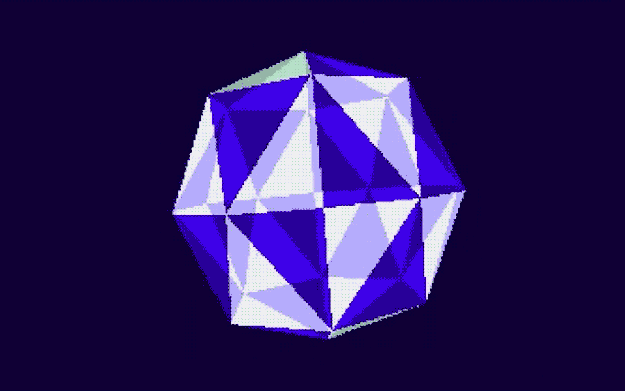
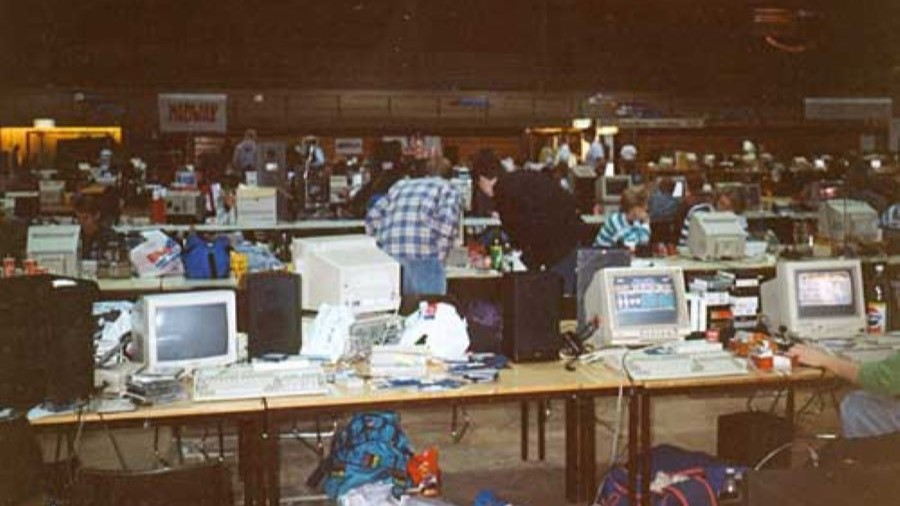
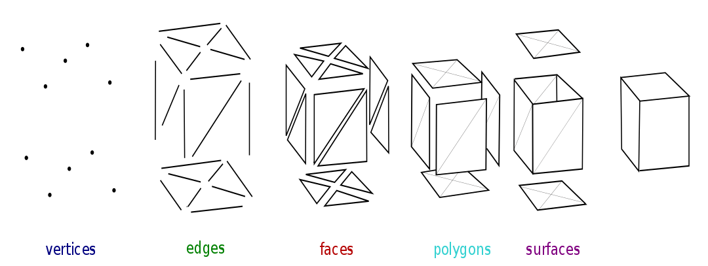
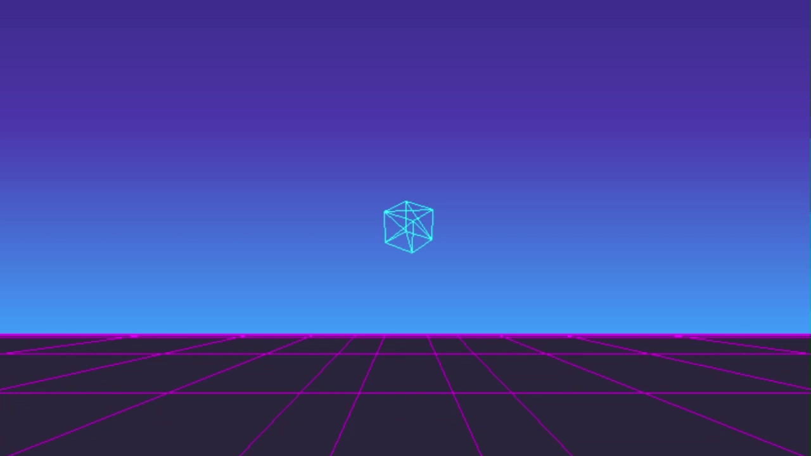
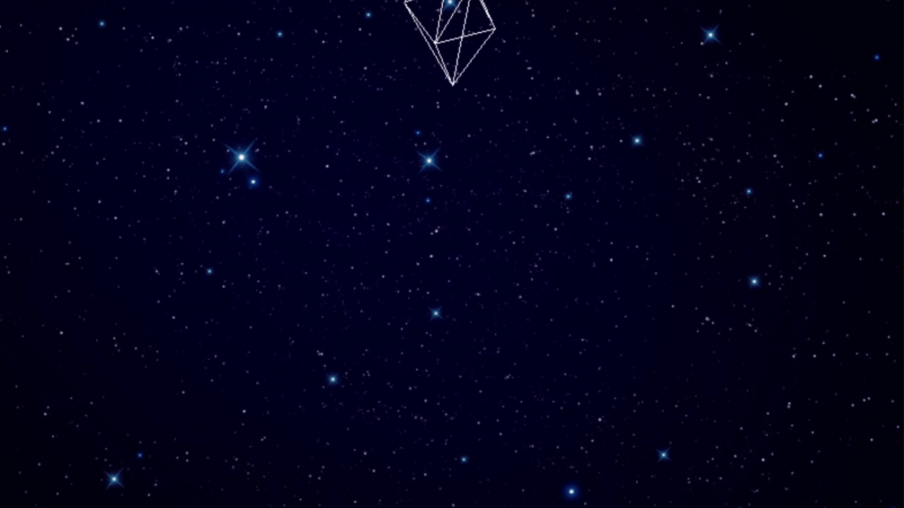
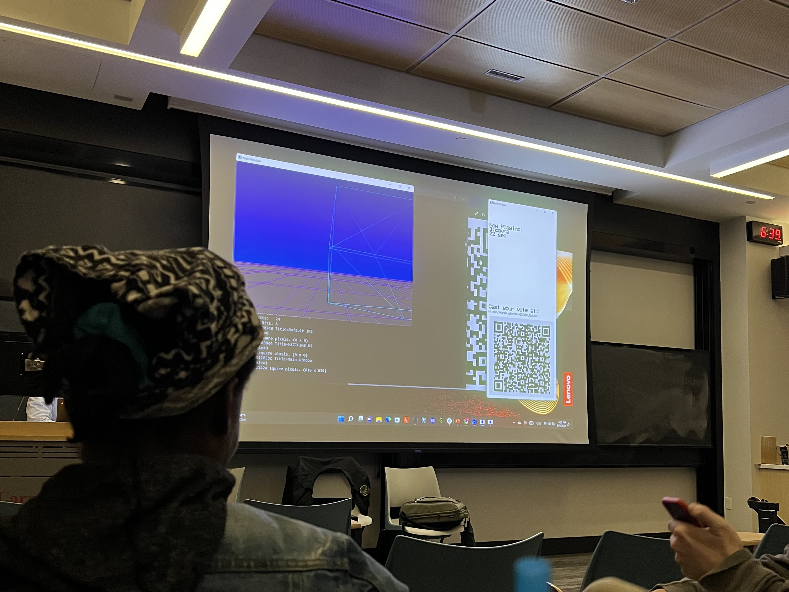

# **Demoscene**

### A non-interactive demonstration of audio and visual programming using OpenGL

---

> Graphics and sound library from [captainys](https://github.com/captainys)

> Audio from [@freemusicc](https://www.youtube.com/watch?v=OuRvOCf9mJ4&ab_channel=FreeMusic)

---

## **What is Demoscene?**

Demoscene is a computer subculture and artistic movement that emerged in the 1980s and centers around the creation of real-time audiovisual demonstrations, known as "demos," on computer platforms. These demos showcase the technical and artistic skills of programmers, artists, and musicians within a limited space and time frame. Demos typically feature graphics, sound, and often innovative programming techniques.

The demoscene began in the 1980s on home computer platforms like the Commodore 64 and Amiga. Early demos were often created by "cracking" groups to showcase their skills in breaking copy protection on games and software. Over time, the focus shifted from cracking to artistic expression and technical prowess. Demoscene groups formed, competing to create the most impressive demos at events known as "demoscene parties."

[Image Source](https://www.teodor.no/commodore/the-demo-scene)

## **Why create a Demo?**

Demoscene places a strong emphasis on technical artistry, where programming and graphic art are mixed to create interesting visual effects, animations, and intricate scenes that challenge the boundaries of what can be achieved with code. Programmers often delve into low-level rendering techniques, shaders, and optimization to create stunning visuals that captivate viewers and showcase their programming prowess.

Demos also often push hardware to its limits, demonstrating what was possible on older systems. Creating demos helps preserve computing history and demonstrates the enduring creativity of the demoscene community.

## **My Demo**

I was inspired by the more geometric-looking graphics in the example demos I watched and wanted to do something similar. I also wanted to incorporate elements of vaporwave and the outrun aesthetic to give it a feel of the 1980s, when demoscene began.

## Audio

While demos can feature a wide variety of music genres, demos on older platforms like the Commodore 64 and Amiga will often use chiptune music, characterized by the distinctive sound of vintage computer and video game hardware like the NES (Nintendo Entertainment System), Commodore 64, Atari 2600, and Game Boy. I chose [Density & Time - MAZE](https://www.youtube.com/watch?v=OuRvOCf9mJ4&ab_channel=FreeMusic).

## 3D graphics from Scratch

It is possible to represent any 2D shape using only triangles. I used this principle to create a rotating cube on a 2D screen writing the original object coordinates, projection matrix, and rotation matrices from scratch in C++.

To do this, I first normalized the screen space as shown below.

Normalizing the screen also ensures that the field of view is not limited to a rectangle but instead a space defined by theta. As theat increases, the field of view increases and has the effect of zooming out. On the other hand, decreasing theta narrows the field of view and has the effect of zooming in. therefore has the following effect on the x and y coordinates of the object that is being projected.

$(x, y) \Rightarrow (\dfrac{\dfrac{w}{k}*\dfrac{1}{tan(\theta/2)}}{z})x, (\dfrac{\dfrac{1}{tan(\theta/2)}}{z})$

When objects are further away, they appear to move less. This means the $x$ and $y$ coordinates are also affected by the depth. This is expressed in Eq. 1 by dividing both $x$ and $y$ by $z$.

To define $z$, virtual points $z_{near}$ and $z_{far}$ are first defined to normalize and create a scaling factor for the input $z$ values of the desired shape.

$scaling factor = z_{normalized} - offset$

$scaling factor = \dfrac{z_{far}}{z_{far}-z_{near}} - \dfrac{z_{far}*z_{near}}{z_{far}-z_{near}}$

Thus,

$(x, y, z) \Rightarrow \left((\dfrac{\dfrac{w}{k}*\dfrac{1}{tan(\theta/2)}}{z})x, (\dfrac{\dfrac{1}{tan(\theta/2)}}{z}), \dfrac{z_{far}}{z_{far}-z_{near}}z - \dfrac{z_{far}*z_{near}}{z_{far}-z_{near}}\right)$

Let aspect ratio, $a = \dfrac{w}{h}$, field of view, $f = \dfrac{1}{tan(\theta/2)}$, and $q = z_{normalized} = \dfrac{z_{far}}{z_{far}-z_{near}}$, such that $(x, y, z)$ simplifies to:

$(x, y, z) \Rightarrow \dfrac{af}{z}x, \dfrac{f}{z}y, qz - qz_{near}$

Such that now we have a projection matrix:

$ M = \begin{pmatrix}
af & 0 & 0 & 0 \\
0 & f & 0 & 0 \\
0 & 0 & q & 1 \\
0 & 0 & -qz_n & 0
\end{pmatrix} $

3d affine transformation matrices can then be used for translating, scaling, or rotating the points before projecting them:

$$
\begin{bmatrix}
    a \\
    b \\
    c \\
    \end{bmatrix}
$$

$R_x(\theta) =
\begin{pmatrix}
    1 & 0 & 0 & 0 \\
    0 & cos(\theta) & sin(\theta) & 0 \\
    0 & -sin(\theta) & cos(\theta) & 0 \\
    0 & 0 & 0 & 1
    \end{pmatrix}
$,
$ R_y(\theta) =
\begin{pmatrix}
cos(\theta) & 0 & -sin(\theta) & 0 \\
0 & 1 & 0 & 0 \\
sin(\theta) & 0 & cos(\theta) & 0 \\
0 & 0 & 0 & 1
\end{pmatrix}
$,
$ R_z(\theta) =
\begin{pmatrix}
cos(\theta) & -sin(\theta) & 0 & 0 \\
sin(\theta) & cos(\theta) & 0 & 0 \\
0 & 0 & 1 & 0 \\
0 & 0 & 0 & 1
\end{pmatrix}
$

## **GIFs**

Although I used an OpenGL graphics library, I wrote all of the projection, translation, rotation, and scaling matricies from scratch. Each line in the cube is drawn between 2 points and rendered. Then a transform is applied to each point in the cube, the buffer is cleared, and the lines are drawn again in the cubes next state.

One of the key elements of the vaporwave aesthetic is the large sun. I used shading to create a neon pink to light blue gradient.

For the last scene, although this technique would not have been possible if I were creating a demo to be played on old hardware, I added a .png background that eventually pans up to the ending screen.

I used the same technique to animate the octehedron as I did the cube except I restricted rotation and translation to the $y$ axis.

## **CMU's Mini-Demoparty**

At the end of the project, everyone from the class gathered for our own mini-demoparty. We rated each demo and the professor announced the top three winners.

My demo won second place :D

$$
$$
